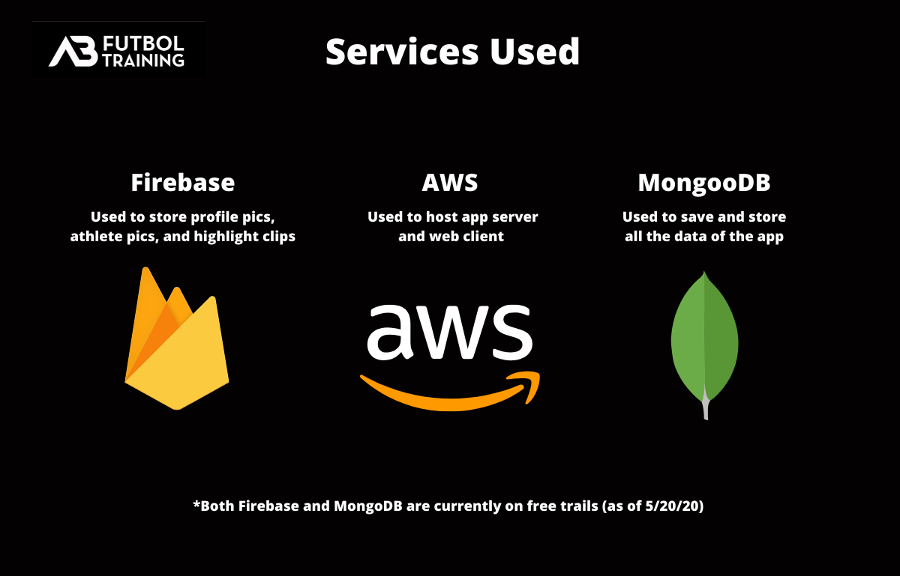
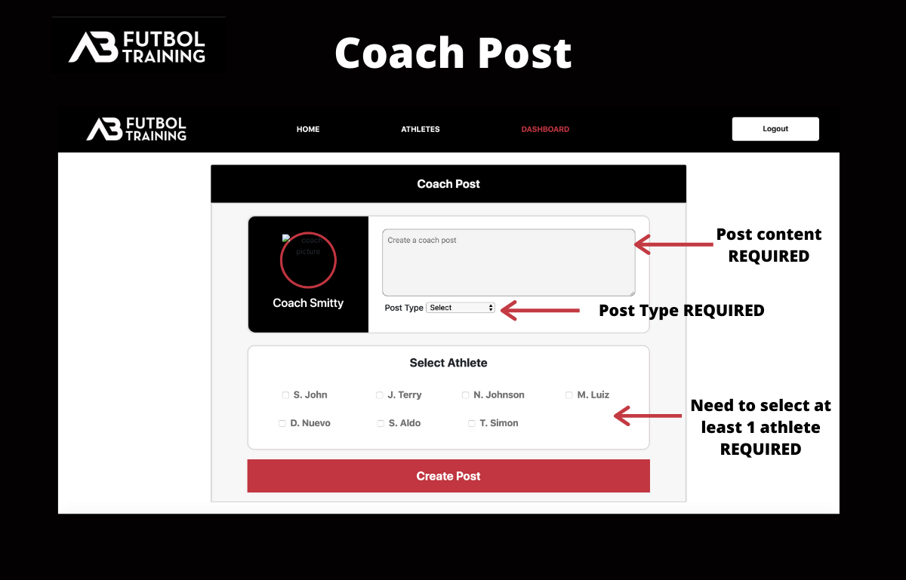
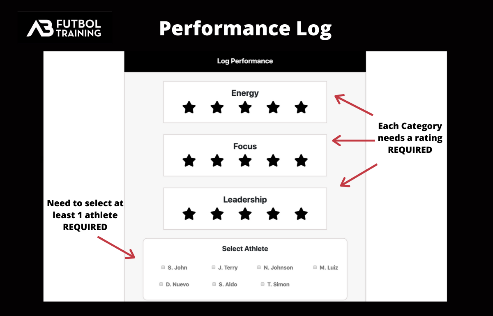
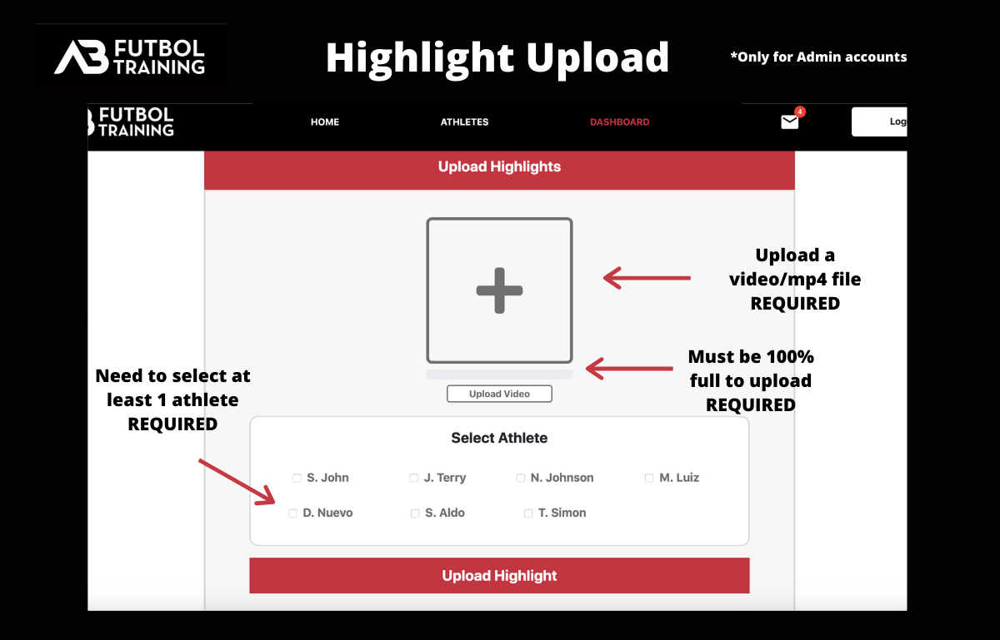
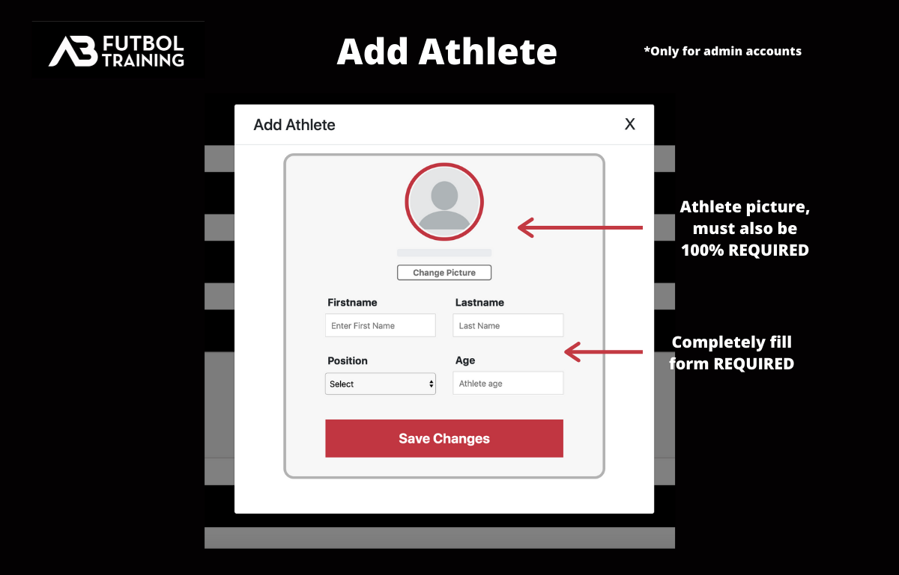
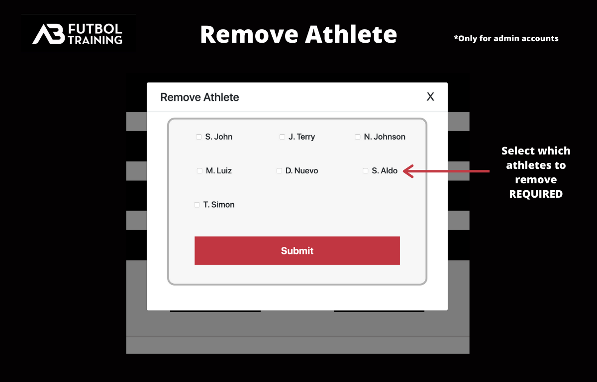
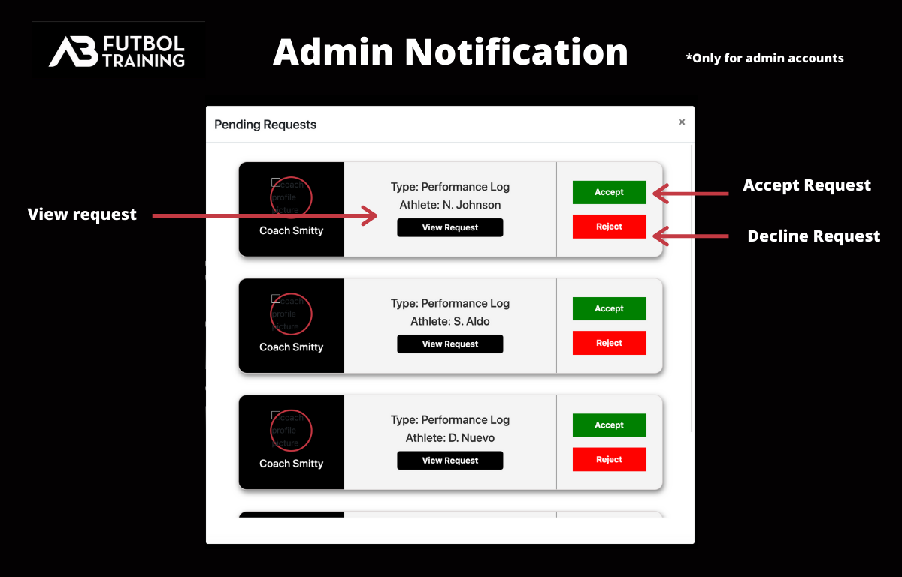
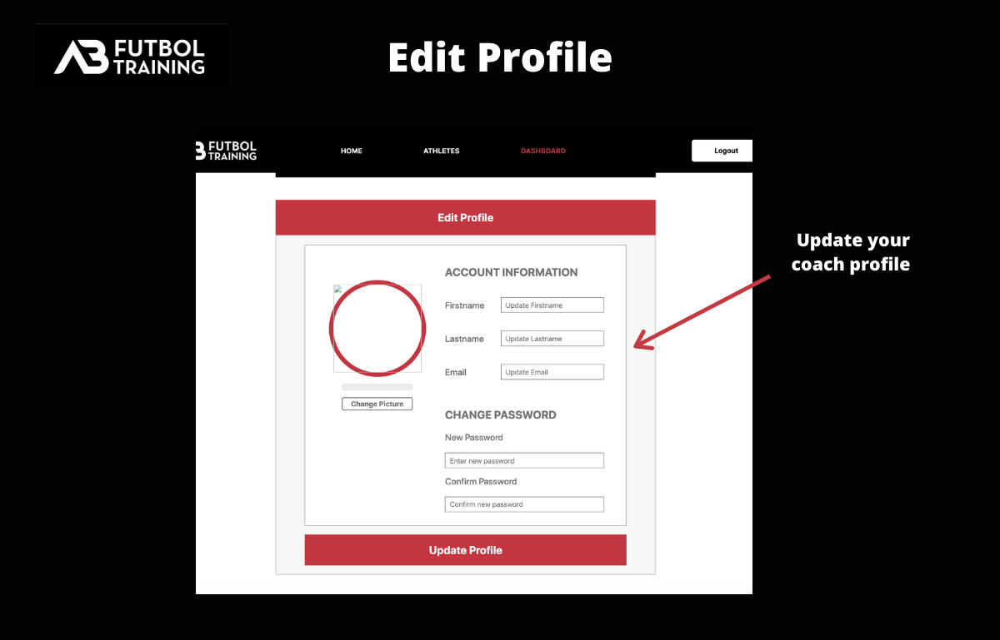
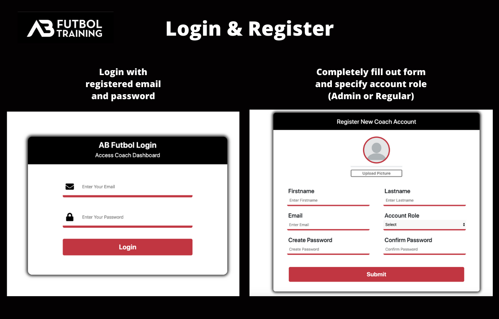

This is the client side of AB Futbol-Training Academy, I decided to split up the server side into its own repo same with the client side. 

This a breakdown of how a coach account works and all the different things you are able to do

Services used to build app

Creating a coach post

Creating a performance log

Creating a highlight

Add a new athlete

Remove an athlete

Admin notification 

Edit coach profile 

Login and Register

